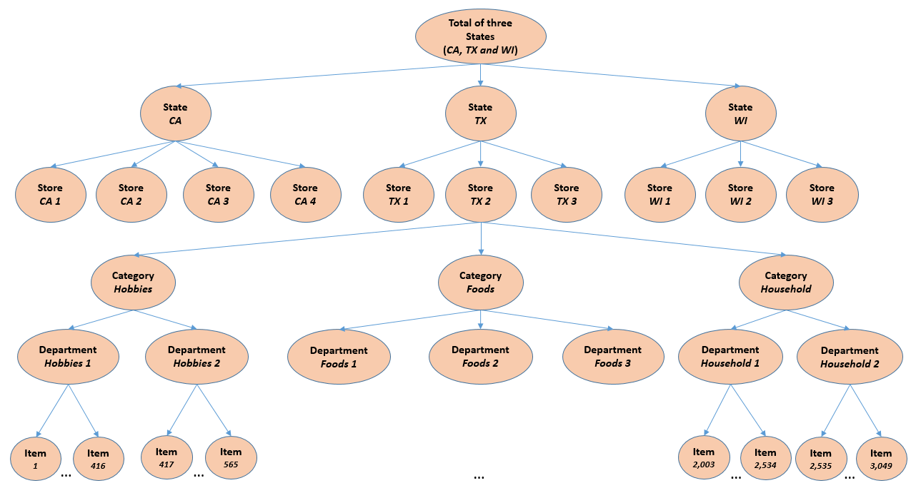

# M5 forecasting Kaggle competition

## Context
This is a little project to practice time-series data analysis and forecasting with large datasets. The data is from the [M5 forecasting competition](https://www.kaggle.com/c/m5-forecasting-accuracy/overview) hosted on Kaggle.

The dataset contains over 46 million records of sales from Wallmart across ten stores and three product categories. The data is hierarchical, the finest granularity being the sales of an item on a given day for a given store:



## Project structure
The repository is organized around notebooks describing each steps of the exercise:
* **01-melt_and_merge** restructures the data to ease it's usage with tabular models. It outputs a unique parquet file containing all the data where each row is the sales of item in a store for a given day, calendar informations and selling price.

* **02-eda** is an extensive exploratory data analysis about the sales dynamics along several dimensions in order to better understand the dataset and get insights for modeling.

* **03-baseline** contains the implementation of a gradient boosted trees (using Microsoft's LGBM implementation). The restructured dataset is augmented with around 60 time-varying feature (such as rolling statistics, best autocorrelated lags per items, ...)

* **04-deep_models** implements a particular neural network architecture with Pytorch. The architecture is composed of three blocks: 
    * A linear autoregressive block to learn inputs scale variations dependencies,
    * A two-scales convolutional neural network block to learn non-linear long term and short term dependencies,
    * A categories embedding block to learn a representation of time-independent covariates (store, department, state, ...)

For readability, most of the code is packaged dedicated files:
* operations on dataset in dataset.py
* LGBM model in models.py
* Neural network in deep_models.py

## Getting Started

Just clone this repository:
```
git clone https://github.com/clabrugere/M5-forecasting.git
```

Download the competition dataset from Kaggle and put it in:
```
data/raw/
```

### Requirements

* Python 3.7
* numpy
* pandas
* plotly
* matplotlib
* statsmodels
* pytorch
* sklearn
* optuna

## License

This project is licensed under the MIT License - see the [LICENSE.md](LICENSE.md) file for details

## Acknowledgments
* [Amazing Head or Tail notebook](https://www.kaggle.com/headsortails/back-to-predict-the-future-interactive-m5-eda) on Kaggle, from which I heavily borrowed (but re-implemented in python as it's originally in R).
* [DSANet: Dual Self-Attention Network for Multivariate Time Series Forecasting](https://dl.acm.org/doi/10.1145/3357384.3358132) for the neural network architecture inspiration.
